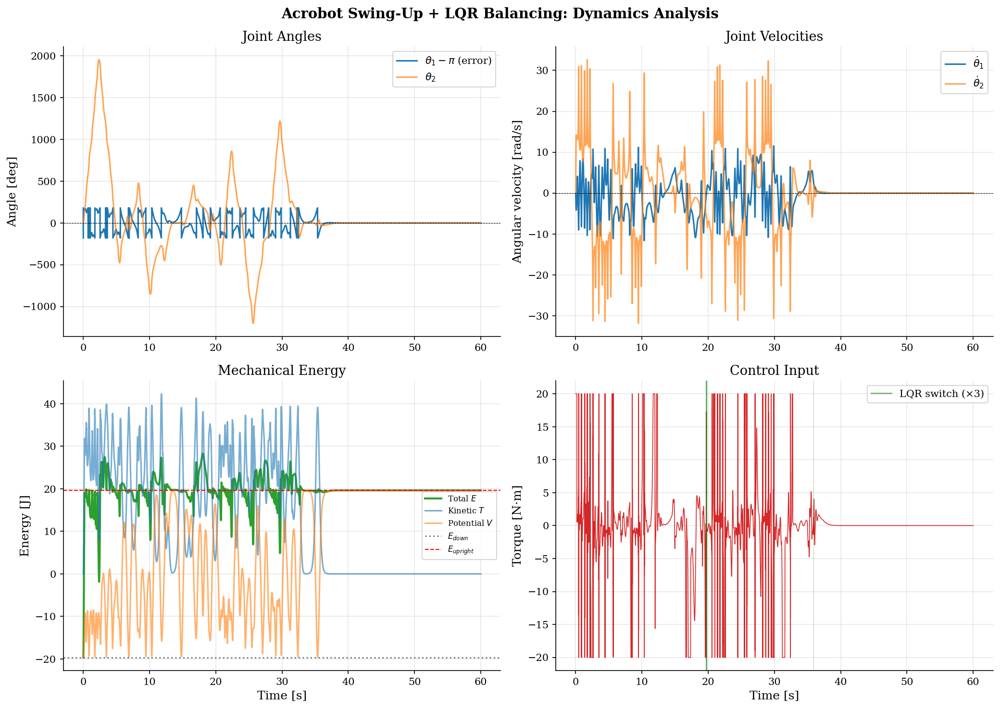
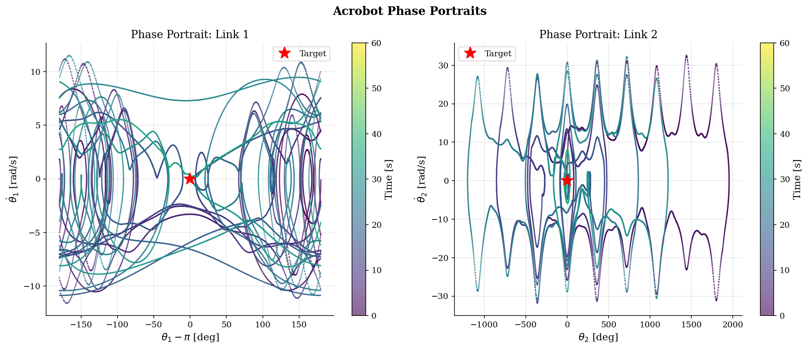

# Acrobot Control Simulation

[](LICENSE)
[](https://www.python.org/downloads/)
[](#testing)

A high-performance, publication-quality simulation of the **Acrobot** (underactuated two-link planar robot) with **energy-based swing-up** and **LQR optimal balancing** control.

> **Benchmark Reference:** Spong, M.W. (1995). "The Swing Up Control Problem for the Acrobot." *IEEE Control Systems Magazine*, 15(1), 49-55.

---

## System Description

The Acrobot is a canonical underactuated mechanical system consisting of two serial links in a vertical plane. Only the second joint (elbow) is actuated while the first joint (shoulder) swings freely, making it a challenging benchmark for nonlinear control.

**Equations of Motion (Euler-Lagrange):**

$$M(q)\ddot{q} + C(q, \dot{q})\dot{q} + G(q) = B u$$

where $q = [\theta_1, \theta_2]^T$, $B = [0, 1]^T$ (underactuated), and:

- $M(q)$: configuration-dependent inertia matrix (symmetric, positive-definite)
- $C(q, \dot{q})$: Coriolis/centrifugal matrix (Christoffel symbols)
- $G(q)$: gravity torque vector

**State vector:** $x = [\theta_1, \theta_2, \dot{\theta}_1, \dot{\theta}_2]^T$

| Symbol | Description | Convention |
|--------|-------------|------------|
| $\theta_1$ | Link 1 angle | From vertical downward, counterclockwise positive |
| $\theta_2$ | Link 2 angle | Relative to link 1 |
| $u$ | Control torque | Applied at elbow joint only |

---

## Simulation Results

### Dynamics Analysis



**Figure 1.** Four-panel dynamics analysis of the Acrobot swing-up and balancing simulation.

- **Top-left (Joint Angles):** The first link angle error $\theta_1 - \pi$ starts at $-180°$ (downward) and converges to $0°$ (upright) through the swing-up phase (0–36s). The second link angle $\theta_2$ oscillates during swing-up due to the energy pumping + PFL regulation, then converges to zero during LQR balancing. The large excursions of $\theta_2$ during the swing-up phase (up to $\pm 170°$) reflect the aggressive energy injection required to overcome the 39.24 J energy barrier.

- **Top-right (Joint Velocities):** Angular velocities exhibit high-amplitude oscillations during the swing-up phase, reaching peaks of $\pm 10$ rad/s. The velocity profiles reveal the characteristic energy exchange between kinetic and potential energy. After LQR capture (~36s), velocities rapidly converge to zero, demonstrating the effectiveness of the linear feedback stabilization.

- **Bottom-left (Mechanical Energy):** Total energy $E$ transitions from $E_{down} = -19.62$ J to $E_{upright} = +19.62$ J through the energy shaping controller. The energy shaping term $u_e = -k_e \tilde{E} \dot{\theta}_2$ drives the Lyapunov function $V = \frac{1}{2}\tilde{E}^2$ to zero. The energy trajectory shows multiple overshoots and corrections before converging, characteristic of the nonlinear energy landscape and actuator saturation ($\pm 20$ N·m).

- **Bottom-right (Control Torque):** The control input shows bang-bang-like behavior during aggressive energy pumping, transitioning to smooth LQR feedback after capture. Green vertical lines mark controller switching events (3 total), indicating a clean transition without chattering. The RMS control effort of 5.45 N·m is well within the actuator limits.

### Phase Portraits



**Figure 2.** Phase portraits of both joints, with color encoding time progression (purple → yellow).

- **Left ($\theta_1$ phase plane):** The trajectory spirals outward from the downward equilibrium (initial purple cluster at $-180°$) through increasingly large oscillations, eventually reaching the upright equilibrium at $(0°, 0)$ (yellow convergence point). The spiral structure reveals the energy pumping mechanism: each swing cycle adds energy until the homoclinic orbit energy is reached. The trajectory then collapses onto the upright fixed point under LQR control.

- **Right ($\theta_2$ phase plane):** The second link exhibits bounded but complex oscillations during swing-up. The collocated PFL term ($u_p$) acts as a virtual spring-damper, preventing unbounded rotation of $\theta_2$ while allowing sufficient motion for energy transfer. The final convergence to $(0, 0)$ confirms successful regulation of both joints.

### Animation


**Figure 3.** Animated visualization of the Acrobot swing-up and balancing. The blue trail shows the tip trajectory. The system transitions from the stable downward equilibrium to the unstable upright position through coordinated energy pumping, then maintains balance indefinitely via LQR feedback.

---

## Performance Summary

| Metric | Value |
|--------|-------|
| Swing-up time (first approach) | 6.14 s |
| Settling time | 36.43 s |
| Final angle error | 0.0000° |
| RMS control effort | 5.45 N·m |
| Max control torque | 20.0 N·m |
| Controller switches | 3 |
| Simulation speed (60k steps) | 0.75 s |

---

## Control Architecture

### Two-Phase Hybrid Control

**Phase 1: Energy-Based Swing-Up** (Drake/Spong Controller)

$$u = u_e + u_p$$

The energy shaping term drives the total energy toward the upright equilibrium:

$$u_e = -k_e (E - E_d) \dot{\theta}_2$$

The collocated Partial Feedback Linearization (PFL) term regulates $\theta_2$:

$$u_p = a_3 y + f_2 - a_2 f_1$$

where $y = -k_p \theta_2 - k_d \dot{\theta}_2$ is a virtual PD controller, and $a_2, a_3, f_1, f_2$ are derived from the manipulator dynamics via Schur complement decomposition.

**Phase 2: LQR Optimal Balancing**

$$u = -K(x - x_{eq})$$

where $K = R^{-1} B^T P$ and $P$ solves the Continuous Algebraic Riccati Equation (CARE).

**Switching Logic:** Lyapunov distance $d(x) = (x - x_{eq})^T P (x - x_{eq})$ with hysteresis to prevent chattering.

### Physical Parameters (Spong/Drake Canonical)

| Parameter | Symbol | Value | Unit |
|-----------|--------|-------|------|
| Link 1 mass | $m_1$ | 1.0 | kg |
| Link 2 mass | $m_2$ | 1.0 | kg |
| Link 1 length | $l_1$ | 1.0 | m |
| Link 2 length | $l_2$ | 1.0 | m |
| Link 1 CoM distance | $l_{c1}$ | 0.5 | m |
| Link 2 CoM distance | $l_{c2}$ | 0.5 | m |
| Link 1 inertia (CoM) | $I_{c1}$ | 0.083 | kg·m² |
| Link 2 inertia (CoM) | $I_{c2}$ | 0.083 | kg·m² |
| Joint damping | $b_1, b_2$ | 0.1 | N·m·s/rad |
| Gravity | $g$ | 9.81 | m/s² |

---

## Quick Start

```bash
# Clone
git clone https://github.com/lsh330/Acrobot_Control_Simulation.git
cd Acrobot_Control_Simulation

# Install dependencies
pip install -r requirements.txt

# Run default simulation (60s, hybrid control)
python main.py

# Run with animation
python main.py --save-gif

# Custom parameters
python main.py --t-final 30 --save-gif --output-dir my_output

# Run tests
python -m pytest acrobot/tests/ -v
```

## Project Structure

```
acrobot/
├── core/               # Configuration, constants, type definitions
│   ├── config.py       # Frozen dataclass hierarchy (YAML/CLI support)
│   ├── constants.py    # Physical constants, numerical tolerances
│   └── types.py        # SimulationResult NamedTuple, type aliases
├── parameters/         # Physical and derived system parameters
│   ├── physical.py     # Spong/Drake canonical parameter set
│   ├── derived.py      # Lumped parameters (alpha, beta, delta, phi1, phi2)
│   └── validation.py   # Physical consistency checks
├── dynamics/           # Lagrangian mechanics (all Numba @njit)
│   ├── mass_matrix.py  # M(q): symmetric, positive-definite
│   ├── coriolis.py     # C(q,dq): Christoffel symbols
│   ├── gravity.py      # G(q): potential energy gradient
│   ├── energy.py       # Kinetic, potential, total energy
│   ├── equations_of_motion.py  # f(x,u): state derivative
│   ├── jacobian.py     # Analytical linearization at upright
│   └── lagrangian.py   # L = T - V
├── linearization/      # Linear system analysis
│   ├── equilibrium.py  # Equilibrium points
│   ├── state_space.py  # A, B matrices
│   └── controllability.py  # Kalman rank condition
├── control/            # Controller implementations
│   ├── lqr.py          # CARE solver, optimal gain K
│   ├── energy_swing_up.py  # Drake/Spong PFL + energy shaping
│   ├── hybrid.py       # Swing-up → LQR hybrid controller
│   └── switching.py    # Lyapunov-based switching with hysteresis
├── simulation/         # Numerical simulation engine
│   ├── integrator.py   # RK4 (Numba JIT, zero-allocation)
│   ├── runner.py       # Pre-allocated simulation loop
│   ├── initial_conditions.py  # State generators
│   └── disturbance.py  # Band-limited noise, impulse
├── analysis/           # Post-simulation analysis
│   ├── stability.py    # LQR verification (eigenvalues, CARE residual)
│   └── performance.py  # Swing-up time, settling time, metrics
├── visualization/      # Publication-quality outputs
│   ├── plots.py        # Static analysis figures
│   ├── animation.py    # Animated GIF generator
│   └── style.py        # Journal-quality matplotlib config
├── tests/              # Comprehensive test suite (23 tests)
│   ├── test_dynamics.py    # Physics invariants, energy conservation
│   ├── test_control.py     # LQR stability, full swing-up test
│   └── test_parameters.py  # Validation, derived values
├── pipeline/
│   └── orchestrator.py # End-to-end workflow
└── utils/
    ├── timer.py        # Performance measurement
    └── logger.py       # Minimal logging
```

## Testing

```bash
$ python -m pytest acrobot/tests/ -v
========================= 23 passed in 2.47s =========================
```

Tests cover:
- **Dynamics:** Mass matrix (symmetry, positive-definiteness, inverse), gravity at equilibria, energy conservation (<0.1% RK4 drift), EOM at rest
- **Control:** Controllability rank, LQR eigenvalues, CARE residual (<1e-6), full 60s swing-up convergence
- **Parameters:** Validation edge cases, derived parameter consistency

## References

1. Spong, M.W. (1995). "The Swing Up Control Problem for the Acrobot." *IEEE Control Systems Magazine*, 15(1), 49-55.
2. Xin, X. & Kaneda, M. (2007). "Analysis of the Energy-Based Swing-Up Control of the Acrobot." *Int. J. Robust Nonlinear Control*, 17(16), 1503-1524.
3. Astrom, K.J. & Furuta, K. (2000). "Swinging up a Pendulum by Energy Control." *Automatica*, 36(2), 287-295.
4. Tedrake, R. *Underactuated Robotics.* MIT OpenCourseWare.
5. Anderson, B.D.O. & Moore, J.B. (1990). *Optimal Control: Linear Quadratic Methods.* Prentice Hall.
6. Drake: `AcrobotSpongController` implementation, MIT Robot Locomotion Group.

## License

This project is licensed under the MIT License — see [LICENSE](LICENSE) for details.
